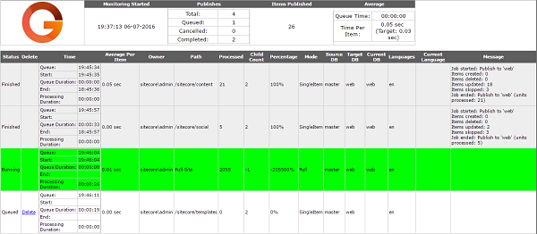



# Glass Publish Viewer

The viewer allows you to monitor the publishing queue on the Sitecore Publishing CM Server, see their current status and
cancel publishing jobs if required.

This viewer is a rewrite of the original publish viewer created by
 [MRUNAL BRAHMBHATT](https://profile.sitecore.net/Profile.aspx?userId=2LyDNXKnWsyhSS8dDFuWb0KKp-6EKdt4jMhtl52LMyc%3d)
which can be found on the [Sitecore MarketPlace](https://marketplace.sitecore.net/en/Modules/P/Publish_Viewer.aspx). 
All of the credit on how to extract information about a publish should go to MRUNAL.

This module is distributed under the MIT license, which you can read in the [Licence.txt](Licence.txt) file.

This module has been written very quickly to solve a specific problem. Therefore there is lots of room for improvement.
Please branch and go nuts adding more reporting.

Tested in Sitecore 8 and Sitecore 8.1

## Features
The module supports the following features:

* List current publishes including:
  * Time queued
  * Time publish job started
  * Duration in the queue
  * Number of items published
  * Average time to publish an item
  * All messages from the publish job
 * Ability to delete queued jobs - not that the user who started the publish will see blank screen if their publish is cancelled.
 * Global stats are reported from the Monitoring Started date. This is normally the app start time.
   * Total number of publishes 
   * Number of cancelled publishes
   * Average time in queue
   * Total number of items published
   * Average items per hour
   * Average publishes per hour
   

## Installation

Installation is simple but the application will report jobs on a server performing publishes. If you are using 
a separate publishing server you need to perform the installation steps on this server.

1. Drop the Sitecore.Kernel.dll into the **/Libs/Sitecore** folder.
2. Compile the solution.
3. Copy the folder **/Glass.PublishViewer/App_Config/Include/Glass** to your **{website}/App_Config/Include folder***
4. Copy the folder **/Glass.PublishViewer/Sitecore Modules/PublishingViewer** to your folder **{website}/Sitecore Modules**
5. Copy the **Glass.PublishViewer.dll** to your **bin** folder.
6. Navigate to the URL **http://{{domain}}/sitecore%20modules/publishingviewer/PublishViewerPage.aspx**
